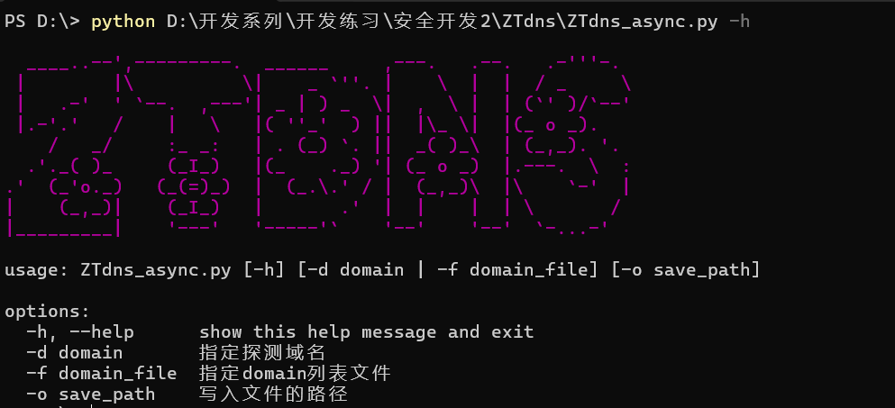
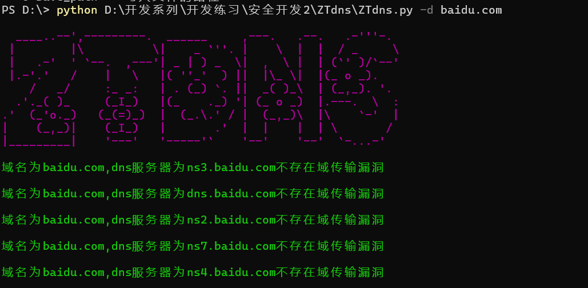

# ZTdns

ZTdns，是一个高性能的dns域传输漏洞扫描器，能快速发现域名是否存在域传输漏洞

## 下载

```txt
git clone https://github.com/youmulijiang/ZTdns.git

cd ZTdns

pip install requirements.txt

python ZTdns.py -h

python ZTdns_async.py -h # 异步模式
```

## 使用截图



## 作者

作者是一个普通的安全开发成员，如果这个项目对你有帮助的话，请点击右上角的⭐

梨酱最喜欢⭐⭐啦  ヾ(≧▽≦*)o*
